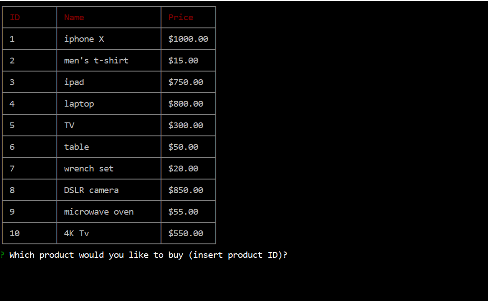
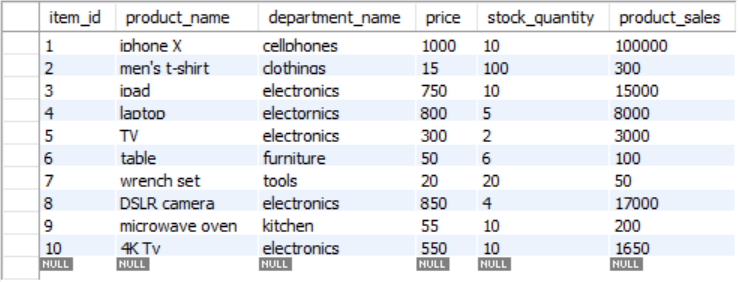
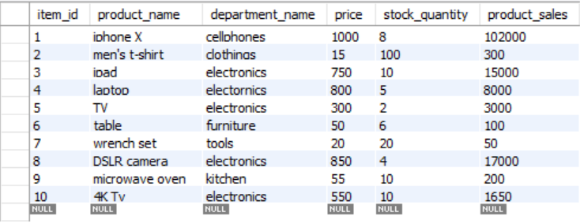
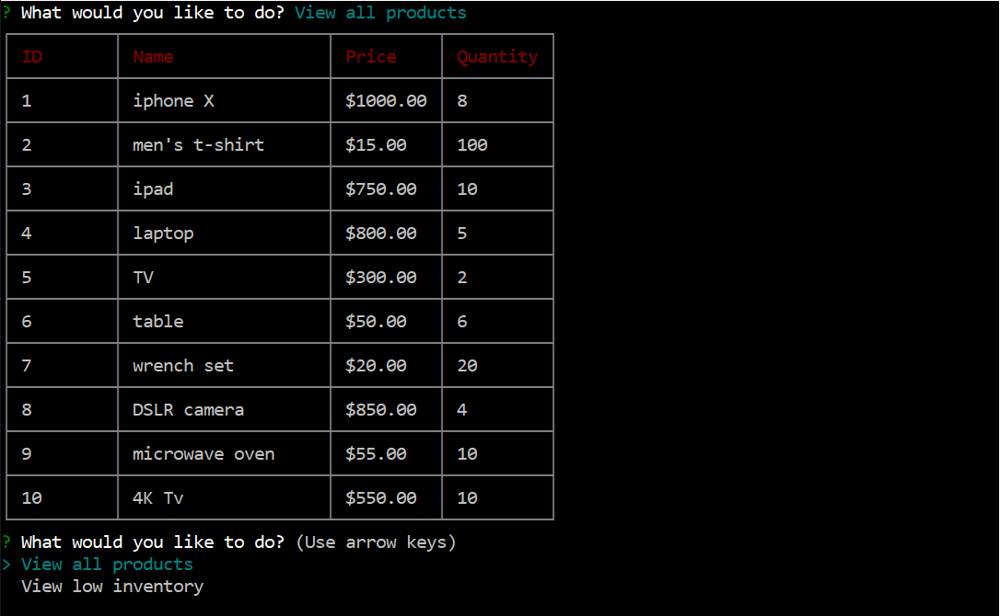
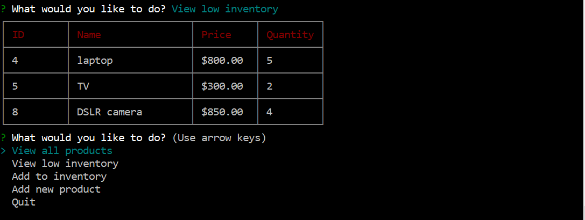
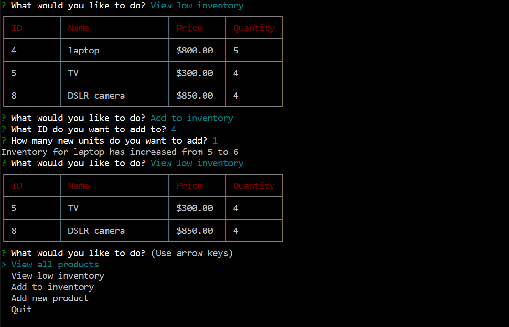
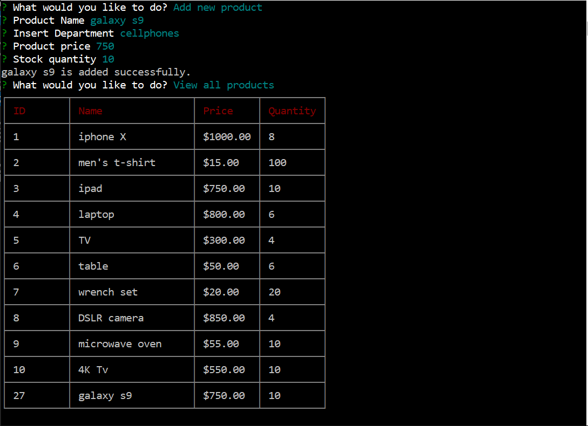
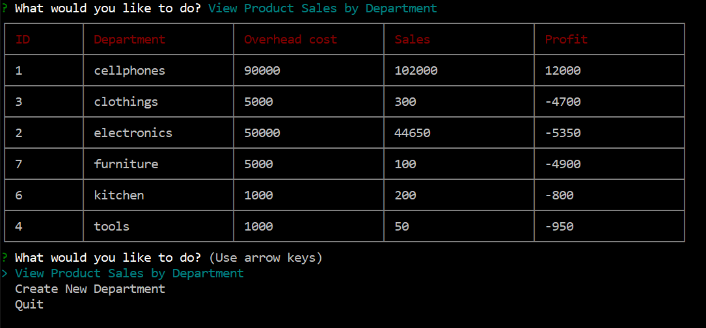

# bamazon_CLI

Bamazon is a CLI node application that sersembles online store where customers can pruchase different products.
The app uses node packages like inquirer, cli-table, and mysql.

The goal of the app is to connect to mySQL database and read/write data in database.
the app consists of 3 apps.
- bamazonCustomer : it allows customers to get all the products from mySQL database and choose a product for purchase.
- bamazonManager: that app is meant for store manager where they can manage inventory and add products.
- bamazonSupervisor: Supervisors can use the app and see revenue the store is making.

## bamazonCustomer

The app will first prompt the user with all products available in the store, then asks the user to purchase any of the products.

the user can choose any item by referring to it's ID number, then choose the quantity.
right after that, the app will review the inputs to the user with total amount and asks user confirmation for purchase. if the user input yes. the transaction goes through and it will update the database both with new stock amount and sales amount.

and here are the changes in database

*BEFORE*

*AFTER*

### Validation:

I added some validation to the app to prevent the user from making wrong inputs.
1- The app filters out any product that has stock_quantity of zero.
2- The user can't request a quantity larger than what the stock offers.
3- the app prevents the user from selecting IDs not showing in the list.

## bamazonManager

The app allows the manager to perform few activities, like viewing the entire store, veiw products with low stock (lower or equals to 5), add to the stock, or can add a new product.

*View all products*

*View low inventory*

*Add to inventory*

as for the last example, the manager successfully added another unit to product and the app showed the manager the amount of increase. then the app removed the item from low inventory.

*Add new product*
Managers can add new products to the products database by inserting product name, department, price, and quantity.
new data will show up at the end of the list with new ID number.

notice that the app pulls in department information from departments table, because managers can't add new departments.

## bamazonSupervisor

This app allows supervisor to see sales of the store, and can create new department to the store.

*View Product Sales by Department*

The app will create new coloumns and do calculations on the fly to show it to the supervisor. it will calculate the sum of all products sale of each department from products table, and compare those sales to the overhead costs of the department.
Notice that the app will ignore any deparment that doesn't have any products.

*Create New Department*

create new department is straight forword, it allows the supervisor to create new department and set the overhead cost of that department. that department will show up in the bamazonManager app later on if they are willing to add new product.

### Validation:

The add department section has some validation messures against dublicate inputs.